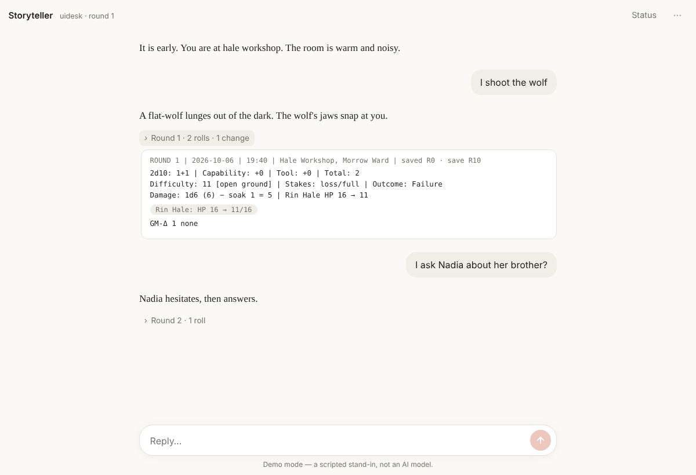
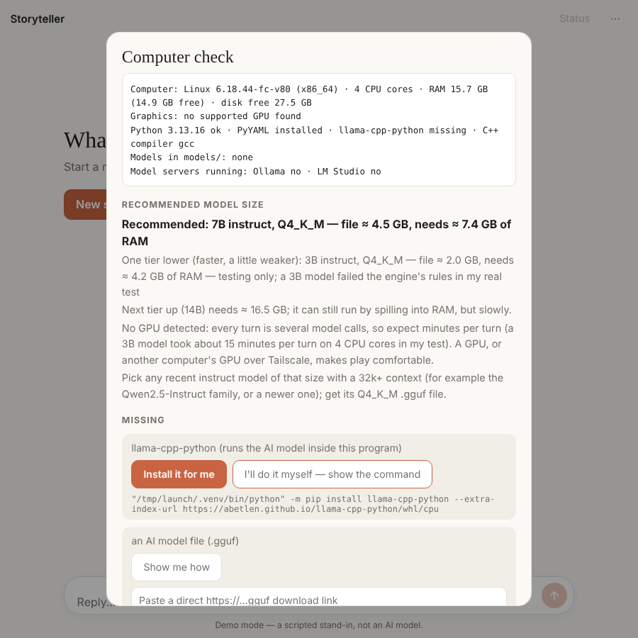
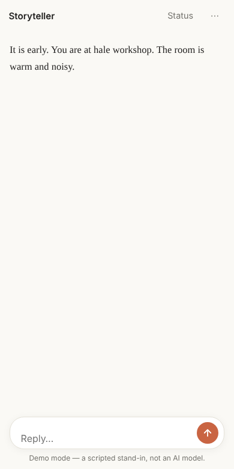

# Storyteller

**A solo role-playing game where an AI is your game master, and a program keeps it honest.**

You type what your character does, in your own words. The AI describes the world and plays everyone in it. The program rolls the dice, tracks health, money, time and inventory, and writes your save files, so the AI can tell the story but cannot fudge the numbers.

It runs on your own computer with an AI model you download once. No account, no subscription, nothing sent to the cloud, and no administrator rights needed.

<p align="center"></p>

*(Screenshot taken in demo mode, which uses a scripted stand-in instead of a real AI, so the story text is placeholder.)*

---

## Why it's fun

- **Say anything.** There are no menus of choices. "I lean on the landlord until he remembers who was here last night" is a valid move, and the world reacts to it.
- **The world keeps moving without you.** People have plans, schedules and grudges. Clocks tick toward floods, raids and sieges whether or not you show up. Wait too long and things happen.
- **Nobody has plot armour, including you.** A failed roll stays failed. Wounds last. Your character can die, and allies can change sides. Nothing is guaranteed to reach you, and nothing is steered toward a "story".
- **Real dice you can see.** Every roll is genuinely random and printed in full (dice, modifiers, difficulty, outcome). Open the small "Round 12 · 2 rolls" line under any reply to see exactly what happened.
- **Secrets stay secret.** The game master knows the hidden causes behind events. The AI that writes the story is only told what your character can actually see, so it cannot spoil the mystery.
- **Your story is yours.** Every 10 rounds the game writes a plain-text save file you can keep, back up, or continue years later. Saves made with the earlier chat version of this engine can be imported.
- **English or 简体中文.** The first time you open the app it asks which language you want, then remembers your last choice (English is the default). The screens and the story both follow it.
- **Play from your phone.** Run it on your desktop and open it from your phone or another computer over Tailscale.

## What you need

| | |
|---|---|
| A computer | Windows, macOS or Linux, with **Python 3.11+**. 16 GB of RAM is a sensible minimum. A graphics card makes it much faster. |
| An AI model | One downloaded file (a `.gguf`), sized to your computer. The setup assistant tells you which size to get, plus one smaller alternative. |
| Admin rights | **Not needed.** Everything stays in this folder. Delete the folder to remove it all. |

## Quick start

1. Download this repository.
2. Run **`start.bat`** (Windows) or **`./start.sh`** (macOS / Linux). The first time, it checks your computer, tells you what's missing, and asks whether you want to install each item yourself or let the program do it.
3. Put your model file in the `models/` folder (or paste its download link into the app's *Computer check & setup* screen), then **New story** and pick a world.

Full instructions, model sizes, phone access and troubleshooting are in **[INSTALL.md](INSTALL.md)**.

<p align="center"></p>

## Worlds included

| World | What it is |
|---|---|
| **Ashfall: Hunter** | Modern city, demon-blooded private investigator. Traceable clues lead to real danger. |
| **Cyberpunk RED: South Night City** | Street-level survival in 2045. A stolen rent case, corrupt cops, a crashed medical flyer. |
| **Tarnstead: The Drowned Marches** | Grim low fantasy. A bounty hunt, a broken ward, and a town that is flooding. |
| **The Last Scion of the Boundary** | A 17-year-old heir, a besieged fortress, an outnumbered garrison, and an old ring with a secret. |

Make your own by filling in `engine/BACKGROUND_TEMPLATE_v5_0.md`, or choose **Describe an idea** and let the AI draft one (the program checks it before the game starts). Some worlds leave a few fields for you, such as your character's name, and the app asks for them before play begins.

## How a turn works

```
you type an action
   → the program loads the relevant slice of the world and the rules
   → the AI referee decides what is uncertain and what is at stake
   → the program rolls, applies damage, XP, time and clocks, and enforces the rules
   → a second AI writes the story, seeing only what your character can see
   → a checker reads it for invented facts and leaked secrets
   → the program records every change and saves every 10 rounds
```

The rules are the **NEW ENGINE v5.0** documents in `engine/`, quoted to the AI exactly as written. The program does the arithmetic and bookkeeping; the AI does the judgement and the prose. Details: [docs/ARCHITECTURE.md](docs/ARCHITECTURE.md).

<p align="center"></p>

## Honest status

This is an early version.

**Proven:** the dice, rules, saving and loading. 100 automated tests pass, including one that replays a real 120-round campaign save by save and checks that the program reproduces every save exactly, and another that continues from each of those saves.

**Not yet proven:** how good the *storytelling* is. That depends on the AI model you use.
- A small 3B model (tested here, CPU only) ran the whole pipeline but made rules mistakes and invented details, and the checker caught some of them. A general instruct model of 7B or larger is the sensible starting point, and a bigger one is better. I have not yet tested one.
- Without a graphics card each turn takes minutes, because every turn is several AI calls.

**Not built yet:** undoing a mistake and replaying from it, and a few rarely used engine options.

## More

- [INSTALL.md](INSTALL.md): setup, model sizes, phone access, troubleshooting
- [docs/ARCHITECTURE.md](docs/ARCHITECTURE.md): how the work is split between program and AI
- Check an install: `python -m gmhost check` · Check a save: `python -m gmhost audit <save> <background>` · Check a series of saves: `python -m gmhost chain <background> <saves…>`
- Run the tests: `pip install pytest && pytest`

---
Copyright (c) 2026 West132.WL. All rights reserved. See [LICENSE](LICENSE).
